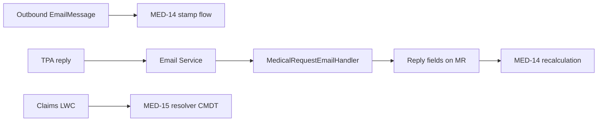

# MED-13 / MED-14 / MED-15 — technical reference

Audience: engineering. Scope: **`Medical_Request__c` only** (Domestic Medical as built in UAT).

MED-15 is **independent** of email/SLA CMDT.

---

## MED-13 — Email (outbound + inbound reply)

### Purpose

Send mail to TPA/provider from a Medical Request; capture replies on the **same** record and stamp reply fields used as the SLA end (MED-14).

### Outbound

| Piece | Detail |
|-------|--------|
| UI | Quick Action **Send Medical Email** (`Medical_Request__c.Send_Medical_Email`) — see `retrieved-qa/quickActions/` |
| Platform | Creates/relates outbound `EmailMessage` (`Incoming = false`, `RelatedToId` = Medical Request Id, key prefix `a3Z`) |
| SLA hook | That create fires the MED-14 flow (first outbound only) |

### Inbound — Email Service + Apex handler

| Piece | Detail |
|-------|--------|
| Apex | [`force-app/main/default/classes/MedicalRequestEmailHandler.cls`](../../force-app/main/default/classes/MedicalRequestEmailHandler.cls) — implements `Messaging.InboundEmailHandler` |
| Tests | `MedicalRequestEmailHandlerTest.cls` |
| Org config | **Setup → Email Services** — Email Service whose Apex class is `MedicalRequestEmailHandler`, with an **Email Service Address**. Replies (or CC/BCC) must reach that address so Salesforce invokes the handler. Service definition is org Setup (not stored as deployable metadata in this repo). |

**Handler logic:**

1. Resolve Medical Request Id from `In-Reply-To` / `References` → match prior `EmailMessage.MessageIdentifier` on an MR; else subject token `[Ref: <Medical_Request_Id>]`.
2. Insert inbound `EmailMessage` (`Incoming = true`) on that MR; save binary/text attachments as `ContentVersion` on the MR.
3. Update MR: `Reply_Received__c = true`, `Last_Reply_Timestamp__c = now`.

**Ops implication:** Outbound threads should include the Email Service address (To/CC as process defines) so TPA replies hit the service and stamp the reply clock.

### Fields touched (inbound)

| Label / API | Role |
|-------------|------|
| `Reply_Received__c` | Reply flag |
| `Last_Reply_Timestamp__c` | SLA end anchor for MED-14 |

---

## MED-14 — SLA tracking

### Purpose

On **first** outbound email to a known TPA domain, stamp targets from matrix; periodically recalculate elapsed / overdue until reply (or now).

### Config — `SLA_Matrix_Rule__mdt`

| Field | Role |
|-------|------|
| `Record_Type__c` | Claims / Approvals / Miscellaneous |
| `Domain__c` | Usually full TPA email; flow matches with **Contains** extracted To-domain |
| `Service_Type__c` | Key for Approvals + Miscellaneous |
| `Action_Done__c` | Key for Claims |
| `Days__c` / `Hours__c` | Target (one typically set) |

- Schema: `force-app/main/default/objects/SLA_Matrix_Rule__mdt/`
- Rows: `force-app/main/default/customMetadata/SLA_Matrix_Rule.*` (~342)
- Seed: [`docs/cmdt-seed/sla-matrix/`](../cmdt-seed/sla-matrix/)

### Flow — stamp targets

[`force-app/main/default/flows/Record_Triggered_Outbound_Email.flow-meta.xml`](../../force-app/main/default/flows/Record_Triggered_Outbound_Email.flow-meta.xml)  
(also under `retrieved-sla/`)

| Step | Behaviour |
|------|-----------|
| Start | `EmailMessage` after insert, `Incoming = false`, `RelatedToId` starts with `a3Z` |
| Get MR | Load Medical Request |
| First email? | Only if `First_Outbound_Email_Date__c` is null |
| Domain | Formula `domain_var` = part after `@` on ToAddress |
| RT branch | **Claims** → Get by Action Done; **Approvals** → Get by Service Type; **Miscellaneous** → dedicated Get by Service Type |
| Rule found | Any of the three Gets has an Id |
| Stamp | `First_Outbound_Email_Date__c`, `Target_Days__c`, `Target_Hours__c` via `Days_var` / `Hours_var` |

Get elements: `Copy_2_of_Get_SLA_Matrix_Rule` (Claims), `Copy_1_of_Get_SLA_Matrix_Rule` (Approvals), `Get_SLA_Matrix_Rule_Miscellaneous` (Misc).

### Recalculation Apex

| Class | Path | Role |
|-------|------|------|
| `SLABusinessDaysCalculator` | `force-app/main/default/classes/` | Invocable: Days → Sun–Thu 09:00–17:00; Hours → continuous; overdue if elapsed &gt; target |
| `SLARecalculationBatch` | same | Query MRs with start set and not overdue; write elapsed + `Is_Overdue__c` |
| `SLARecalculationScheduler` | same | Jobs `SLA Recalculation :00 / :15 / :30 / :45` |

End datetime for calc = `Last_Reply_Timestamp__c` if set (MED-13 Email Service path), else now.

Scheduled Flow `Scheduled_SLA_Recalculation_Flow` (under `retrieved-sla/`) is superseded by the Apex scheduler.

### MR clock fields (UAT)

| API | Role |
|-----|------|
| `Action_Done__c` | Claims matrix key |
| `First_Outbound_Email_Date__c` | SLA start |
| `Target_Days__c` / `Target_Hours__c` | From CMDT |
| `Elapsed_Working_Days__c` / `Elapsed_Hours__c` | Batch |
| `Is_Overdue__c` | Batch |
| `Reply_Received__c` / `Last_Reply_Timestamp__c` | Inbound / SLA end |

Several of these exist in UAT but are **not** yet under `force-app/.../Medical_Request__c/fields/` — see [org-snapshot-uat.md](org-snapshot-uat.md).

---

## MED-15 — Claims required documents

### Purpose

On **Claims** Medical Requests, show EN/AR required supporting docs from CMDT by provider / TPA / service (and Segment/Plan for AXA & MetLife). Admin-maintained; copyable LWC.

### Config — `Domestic_Medical_Claims_Requirement__mdt`

| Field | Role |
|-------|------|
| `Insurance_Provider__c` | Provider |
| `TPA__c` | TPA |
| `Claims_Service_Type__c` | Maps to MR `Service_Type__c` |
| `Segment__c` / `Plan__c` | AXA / MetLife matching |
| `Requirements_Text_EN__c` / `Requirements_Text_AR__c` | Display |
| `Is_Active__c`, `Sort_Order__c`, `Notes__c` | Admin |

- Schema: `force-app/main/default/objects/Domestic_Medical_Claims_Requirement__mdt/`
- Rows: ~458 under `customMetadata/`
- Seed: [`docs/cmdt-seed/batch/`](../cmdt-seed/batch/)

### Code / UI

| Artifact | Path |
|----------|------|
| Resolver | `force-app/main/default/classes/ClaimsRequiredDocumentsResolver.cls` |
| Controller | `force-app/main/default/classes/ClaimsRequiredDocumentsController.cls` |
| Tests | `ClaimsRequiredDocumentsResolverTest`, `ClaimsRequiredDocumentsControllerTest` |
| LWC | `force-app/main/default/lwc/claimsRequiredDocuments/` |
| Placement | **Claims** flexipage only (`Claims.flexipage-meta.xml`) |

### Context on Medical Request

| Source | Used as |
|--------|---------|
| `Insured_Entity_Insurance_Provider__c` | Provider |
| `TPA__c` | TPA |
| `Service_Type__c` | Service |
| `Contact__r.Account.Segment__c` | Segment (Corporate / SME / Individual) |
| `Insured_Entity__r.Plan_Name0__c` | Plan |
| `RecordType.DeveloperName = Claims` | Visibility |

### Matching logic

1. Visible only for Claims record type.
2. **AXA / MetLife mode** when normalized provider equals TPA and value is axa/metlife: Segment required; if Plan set → Plan must match; if Plan blank → only blank-Plan rules.
3. Priority ladder: Exact (provider + TPA + service) → TPA default (blank service) → service default (blank TPA) → provider default; ties by lowest `Sort_Order__c`.
4. When a service-type row wins, **prepend** TPA Basic Requirements EN/AR (same provider/TPA, plus Segment/Plan filters in AXA/MetLife mode).

---

## Cross-links

| From | To |
|------|----|
| MED-13 outbound `EmailMessage` | Starts MED-14 stamp flow |
| MED-13 Email Service → `MedicalRequestEmailHandler` | Sets reply timestamp → MED-14 end |
| MED-15 | Separate stack; Claims UI only |

---

## Related docs

- [02-functional-spec.md](02-functional-spec.md) — BA/QA rules
- [03-technical-design.md](03-technical-design.md) — inventory / architecture
- [user-guide/](user-guide/README.md) — non-technical ops guide
